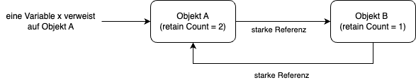

# Was ist Speicherverwaltung? 

So ziemlich jeder, der Software entwickelt und Programme schreibt, kommt um das Thema Speicherverwaltung nicht herum.  
Software zu entwickeln bedeutet, Algorithmen zu entwicklen, die auf Daten zugreifen und Daten verändern, die irgendwo gespeichert sind, sei es im Register einer CPU, im RAM oder auf Festplatte. 
Bei der Speicherverwaltung im Rahmen von Programmiersprachen werden Datenstrukturen im Speicher abgelegt, die dann irgendwann wieder aus dem Speicher entfernt werden müssen, wenn deren Zweck erfüllt ist. 

In einer Idealen Welt hätten wir unendlich viel (RAM-)Speicher und müssten uns nicht um die Speicherverwaltung kümmern. 

Aber wir leben in einer Welt mit endlichen und beschränkten Ressourcen. 

Da ist es auch nicht relevant, dass uns Gigabytes an RAM-Speicher zur Verfügung steht: Die Software wird immer komplexer und derart leistungsfähig, dass sie problemlos Gigabytes an Daten verarbeiten kann. Immer mehr Speicher ist also keine Lösung.

Doch zunächst schauen wir uns an, auf welche Arten Swift Speicher zuweisen kann. 

Wert- und Referenztypen

Die Swift Programmiersprache kennt zwei Arten von Datentypen:

Da sind zum einen die Werttypen wie Strukturen (struct), Aufzählungen (Enumerationen, enum) und primitive Datentypen wie Int, Double und Bool. Werttypen unterstützen die Unveränderlichkeit besser, da bei jeder Änderung eine Kopie erstellt wird. Dies führt zu (Thread-)sichererem Code, da Zustandsänderungen lokal und vorhersehbar sind. Bei Werttypen ist die Speicherverwaltung einfacher (dazu später mehr). 

Referenztypen in Swift sind Typen, deren Instanzen bei der Zuweisung oder beim Übergang an Funktionen nicht kopiert, sondern referenziert werden. 
Referenziert heisst, dass nur die Speicheradresse übergeben wird. 
Referenztypen ermöglichen es, dass mehrere Variablen oder Instanzen auf denselben Objektzustand zugreifen und ihn ändern können.  

Das primäre Beispiel für Referenztypen sind Klassen. 

Ausserdem unterstützen sie Vererbung und Polymorphismus, was die Erstellung von flexiblen und wiederverwendbaren Codehierarchien ermöglicht.

Sie haben eine Identität (sie können verglichen werden, um festzustellen, ob sie dasselbe Objekt sind), was in bestimmten Szenarien nützlich ist, wie z.B. bei der Verwaltung von Zuständen in einem UI-Framework oder bei der Implementierung von Singleton-Mustern.

Bei komplexen Datenstrukturen oder -modellen kann es effizienter sein, mit Referenzen statt mit Kopien zu arbeiten, insbesondere wenn die Daten häufig geändert werden.

Wenn man eine Funktion aufruft und einen Parameter mit übergibt, und dieser ist ein Wertetyp, wird dieser Parameter kopiert : „Call by Value“. 

Bei Referenztypen wird die Referenz, also die Adresse des Objekts übergeben, also „Call by Reference“.  

Heap und Stack

Wer über Wert- und Referenztypen redet, der kommt um deren Speicherverwaltung nicht herum. 
Den Wert- und Referenztypen werden auf unterschiedliche Art und Weise Speicher zugewiesen:  entweder über den Heap oder über den Stack 

Stack - der einfach schnelle Wertetypenspeicher 

Der Stack speichert Wertetypen wie z.B. Enums oder Structs und ist eine Last-in-first-out - Datenstruktur (LIFO): Wenn z.B. eine Funktion aufgerufen wird, werden alle lokalen Daten in der Funktion auf den Stack gepusht. Wurde die Funktion abgearbeitet, werden alle Daten vom Stack entfernt. 

Der Stack hat schnelle Zugriffszeiten, da die Speicherzuweisungen zur Compilezeit geschehen.

Heap - der kostspielige Referenztypenspeicher 

Bei Referenztypen wie z.B. Exemplaren einer Klasse wird der Stack nicht genutzt, da sich Objekte dynamisch in der Speichergröße ändern können. 

Immer, wenn wir in Swift ein neues Exemplar eines Objekts erzeugen, kommt der Heap ins Spiel: Mit den Heap kann beliebig großer Speicherbereich zugewiesen werden, im Gegensatz zum Stack passiert die  Speicherzuweisung während der Laufzeit. Verglichen mit dem Stack ist der Zugriff langsamer und kostet mehr Ressourcen, u.a. wegen der notwenigen Thread-sicherheit, da der Heap von allen genutzt wird. Fordern wir einen Speicherbereich an, sucht der Heap nach einem passenden Speicherbereich und gibt diesen zurück. Wird der Speicherbereich nicht mehr benötigt, muss dem Heap mitgeteilt werden, den Speicher wieder freizugeben. 

Nun wissen wir also, dass Enums sich Speicher vom Heap besorgen und Objekte welchen vom Heap anfordern können. 

Wenn wir ein Objekt per let x = Object() erzeugen, dann müssten wir und eigentlich auch darum kümmern, das Objekt auch wieder freizugeben. 
In C/C++ müsste man dazu explizit free() oder delete() aufrufen. Aber: es kann sein, dass wir das vergessen. 
Die Folge: Objekte, die gar nicht mehr gebraucht werden, können ewig Speicher belegen, der eigentlich schon längst wieder freigegeben werden könnte. Das ist dann ein Speicherleck. 

Wenn man immer wieder Objekte erzeugt aber nie freigibt, ist irgendwann sämtlicher Speicherplatz belegt, obwohl er eigentlich freigegeben werden könnte. Die Folge : Der Rechner wird immer langsamer oder stürzt ab. 

Das Problem dabei ist ja, dass der Entwickler sich um mehrere Dinge gleichzeitig kümmern muss: Erst mal soll er etwas programmieren, was ein Problem löst und zweitens muss er sich noch um die Speicherverwaltung kümmern. 

Können wir nicht etwas bauen, das uns die ganze Speicherverwaltungsarbeit abnimmt?  So dass wir uns nur auf eine Sache konzentrieren können? 

Garbage Collection - der Müllsammler 

Vorhang auf für die automatisierte Speicherbereinigung, auch Garbage Collection genannt! 
Die Garbage Collection wurde erstmalig in LISP (1956) eingeführt, denn man war der Meinung, dass ein Programmierer sich primär um eine Sache - das Entwickeln von Algorithmen für eine Fachdomäne - kümmern sollte und sich noch zusätzlich mit Speicherverwaltungsaufgaben herumschlagen sollte. 

Also: Lass die Speicherverwaltung doch den Computer machen. 

Im Prinzip ist die Garbage Collection ein Prozess, der im Hintergrund läuft und bei allen „root“-Objekten schaut, ob sie erreichbar sind und andere Objekte referenzieren. Alle so erreichbaren Objekte werden markiert („Mark“).  Findet der Garbage Collector keine weiteren Objekte mehr, werden alle nicht markierten Objekte, die im Heap vorhanden sind, entfernt. Diese sind offenbar verwaist, werden nicht mehr referenziert. Sie werden also nicht mehr gebraucht und deren Speicher kann freigegeben werden („Sweep“). Der CG-Algorithmus nennt sich somit „Mark and sweep“.  

 
Eine Alternative zur Garbage Collection : der Retain Count 

Warum hat Swift keine Garbage Collection? Und was verwendet Swift stattdessen?

Der Vorgänger von Swift - Objective C - lief zunächst auf Rechnern mit Prozessor-Technologie der späten 80er Jahre und da waren Computerressourcen ein sehr wertvolles Gut. Das wollte man nicht mit Garbage-Collection - Aufwänden zusätzlich belasten. 

Die Speicherverwaltung musste der Programmierer selbst vornehmen, Hilfestellung erhielt er durch den Retain Count, den jedes Object besaß.
Der Retain Count kann man sich als „Wer referenziert mich denn alles“ - Buchhaltung vorstellen: 

Hat ein Objekt A einen Retain Count von 3, dann bedeutet es, dass es drei andere Objekte per Referenz-Variablen auf A verweisen, also von diesem Objekt abhängen. 

In diesem Fall wäre das Löschen des Objekts ein Riesenfehler, denn es wird ja noch gebraucht (= von anderen Variablen referenziert). Würde man dann auf das bereits gelöschte Objekt zugreifen, gäbe es eine Null-Pointer-Exception, einen Programmabsturz. 

Geben die anderen drei Objekte das Objekt A nacheinander frei - beispielsweise, weil sie selbst gelöscht wurden, muss der Retain Count jeweils um Eins verringert werden. Dies musste der Programmierer explizit durch Aufruf der Methode „release“ machen. 

Verwies ein Objekt A auf ein Objekt B, erhöhte sich der Retain Count von B um eins. Man musste im Code bei der Zuweisung  explizit die „retain“-Methode von B aufrufen. 

Und musste händisch um eins verringert werden, wenn der Verweis aufgelöst wurde  - und zwar indem man die Methode „release“ von B aufrief. 

Als Programmierer musste man immer im Auge behalten, wann retain aufgerufen wurde und wann man release aufrufen sollte. Das war nicht immer leicht zu erkennen und eine schöne Fehlerquelle!

Daher wurde die Automatische Referenzzählung (Automatic Reference Counting, ARC)  von Apple 2011 mit der Veröffentlichung von iOS 5 und OS X Lion für die Programmiersprache Objective-C eingeführt, und später auch bei Swift mit übernommen. 

ARC nimmt dem Programmierer die Aufsicht über release/retain - Aufrufe ab. Der Programmierer musste retain und release nicht mehr manuell aufrufen.  ARC fügt retain und release an den passenden Stellen automatisch hinzu, ohne das der Programmierer etwas davon sieht. Die Magie passiert hier hinter den Kulissen.

ARC hat den Vorteil, dass es die Vorteile einer automatisierten Speicherverwaltung bietet, ohne die Laufzeitkosten und die Komplexität eines vollständigen Garbage Collectors zu verursachen. Da der ARC sich bei Objective C bewährte und auch bei Swift hervorragend funktioniert, wurde er beibehalten. Man musste keinen Garbage Collector implementieren. 

Nun ist doch alles super, oder? Wir haben den ARC, und alles klappt wunderbar ?! 

Leider nein. Es gibt einen Sonderfall beim ARC, den wir als Programmierer berücksichtigen müssen, um nicht unbeabsichtigt ein Speicherleck zu erzeugen.

Der ARC - Mechanismus funktioniert ganz wunderbar, bis auf einen bestimmten Fall: Wenn zwei Objekte sich gegenseitig referenzieren! 
Das bezeichnet mal als Retain Cycle. Der Retain count kann in diesem Fall niemals Null werden, denn es gibt ja immer eine Referenz zu einem Objekt mit Retain count größer als Null. In dem Fall erfolgt niemals Speicherfreigabe. 

Das erzeugt ein Speicherleck - Speicherbereiche, die blockiert bleiben und nicht mehr freigegeben werden können - bis wir das Programm abbrechen oder es mangels Speicher abstürzt oder einfriert.

Hier nochmal der Sachverhalt grafisch dargestellt: 



	Zwei Objekte, die sich gegenseitig referenzieren. Eine Variable verweist auf eines der Objekte 


	Verweist die Variable nicht mehr auf das Objekt, wird der Retain Count von Objekt a um Eins verringert und beide Objekte haben 
	denselben Retain Count von 1 und es kann nicht mehr von aussen auf die Objekte zugegriffen werden. 
	Wir haben ein Speicherleck, da beide Objekte den retain Count von 1 für immer beibehalten werden.

Schwache Referenzen

Um das zu verhindern, wurde das Konzept der schwachen und starken Referenz eingeführt
Eine schwache Referenz hält einen Verweis auf ein Objekt, ohne dessen Retain Count zu erhöhen.

Wenn das referenzierte Objekt freigegeben wird (d.h., wenn sein retain count Null wird), 
wird die schwache Referenz automatisch auf Null gesetzt.



	Zwei Objekte, die sich gegenseitig referenzieren. Eine Variable verweist auf eines der Objekte. 
	In diesem Fall wird Objekt a von Objekt b schwach referenziert.



	Verweist die Variable nicht mehr auf das Objekt, wird der Retain Count von Objekt a um Eins verringert, der retainCount wird zu Null, da wir hier 	eine schwache Referenz von b auf a haben. Objekt a kann gelöscht werden, der retain Count von b verringert sich auf Null und wird dann 
	ebenfalls gelöscht. Das Speicherleck wurde so vermieden. 

Unbesetzte Referenzen 

Neben der schwachen Referenz, die nur mit Optionals arbeitet, gibt es noch die unbesetzte („unowned“) Referenz.
Eine unbesetzte Referenz hält ebenfalls einen Verweis auf ein Objekt, ohne dessen Referenzzähler zu erhöhen.
Im Gegensatz zu schwachen Referenzen wird eine unbesetzte Referenz nicht automatisch auf nil gesetzt, wenn das referenzierte Objekt freigegeben wird. Somit ist eine unbesetzte Referenz kein Optional, im Gegensatz zur schwachen Referenz.
Eine unbesetzte Referenz wird verwendet, wenn eine Referenz erwartet, dass das Objekt während der gesamten Lebensdauer der Referenz existiert, aber zyklische Referenzen vermieden werden sollen. 
Es muss aber sichergestellt sein, dass das Objekt existiert, solange die unbesetzte Referenz verwendet wird!

Referenzen und Closures 

Ein Objekt kann aber nicht nur Referenzen auf andere Objekten haben, sondern auch eine Referenz auf sich selbst. 
Dies kann auftreten, wenn eine Klasse mit Closures arbeitet:

class MyClass {
    var myClosure: () -> Void = {}

    func setupClosure() {
        myClosure = {
            // starke Referenz zu self:
            let _ = self
        }
    }
    
    deinit {
        print("MyClass is being deinitialized")
    }
}

func createAndDestroyMyClass() {
    let myInstance = MyClass()
    myInstance.setupClosure()
}

createAndDestroyMyClass()

In diesem Fall besteht eine starke Referenz von einem Objekt zu sich selbst, und somit haben wir einen retain cycle.
Die Methode „deInit“ wird nie aufgerufen.

Um diese Referenz „weak“ zu machen, sieht Swift für Closures „Capture Lists“ vor. 
In dieser Liste können wir für Variablen, die für Closures sichtbar sind (wie z.B. self) angeben, ob die Variable innerhalb der Closure strong, weak oder unowned sein soll. 
  
Im obigen Beispiel sähe das so aus: 

  func setupClosure() {
        myClosure = {
            // schwache Referenz zu self per capture list: 
	    [weak self] in 
            let _ = self
        }
    }

